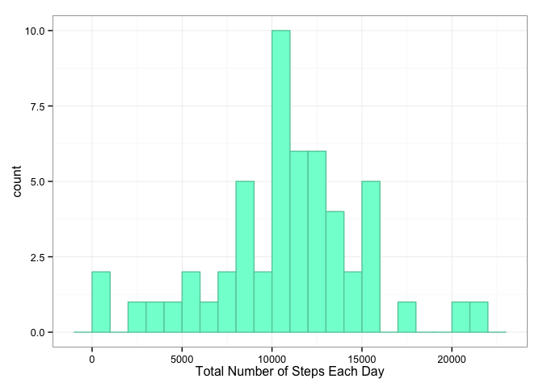
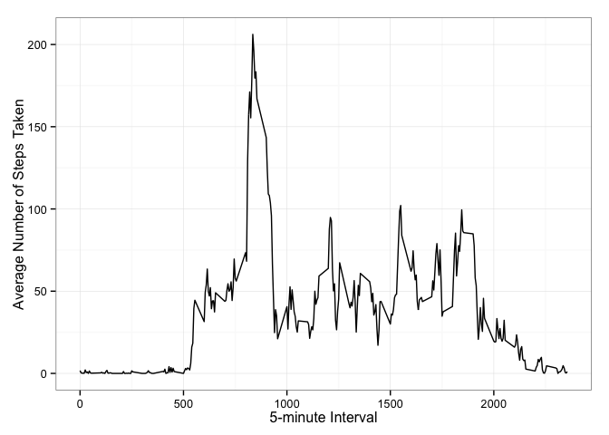
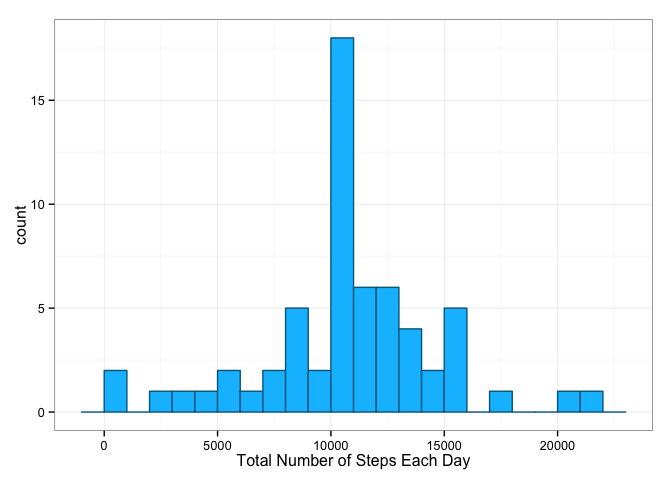

# Reproducible Research: Peer Assessment 1


## Loading and preprocessing the data
The raw data is read in and saved in a data frame called *activityData*. An additional data frame, *activityData_noNA*, is processed from the original raw data where all rows where there "NA" values for the *steps* attribute are removed. Additionally, the dplry library is loaded to be used for manipulating the data. 

```r
library(dplyr) # load dplyr
activityData <- read.csv(file = "activity.csv", header = TRUE) # read in raw dataset
activityData_noNA <- filter(activityData, !is.na(steps)) # create dataset with NA rows removed
```

## What is mean total number of steps taken per day?
This portion of the analysis is performed using the *activityData_noNA* data set. This is because if there were "NA" steps on a given day, there is no data and we want to remove this day all together. Note that "NA" steps is **not** the save as 0 steps.  
Given that the *date* attibute is already a factor, 1 level for each day, the data can by grouped by day and the total number of steps in each day is calculated. The histogram shows the frequency of the total number of steps taken on each day, in bins of 1000. 


```r
# group by date and then find sum of steps for each date
stepsData <- activityData_noNA %>% group_by(date) %>% summarize(totalStepsPerDay = sum(steps))
library(ggplot2) #load ggplot2
# plot histogram
g1 <- ggplot(stepsData, aes(totalStepsPerDay))
g1 + geom_histogram(binwidth = 1000, color = "aquamarine3", fill = "aquamarine") + theme_bw() + labs(x = "Total Number of Steps Each Day")
```

 

```r
# get summary data to find mean and median
stepsSummary <- summary(stepsData$totalStepsPerDay)
stepsSummary
```

```
##    Min. 1st Qu.  Median    Mean 3rd Qu.    Max. 
##      41    8841   10760   10770   13290   21190
```

As can be seen from the summary data above, the mean of the total number of steps taken per day is 1.077\times 10^{4}, and the median of the total number of steps taken per day is 1.076\times 10^{4}.

## What is the average daily activity pattern?
A time series plot of the average number of steps taken, averaged across all days, for each 5-minute interval is generated by grouping the data by interval and then taking the average of the steps on each interval.


```r
# group by interval, and find average of steps for each interval
intervalData <- activityData_noNA %>% group_by(interval) %>% summarise(avgStepsPerInterval = mean(steps))
# plot time series line plot
g2 <- ggplot(intervalData, aes(interval, avgStepsPerInterval))
g2 + geom_line() + theme_bw() + labs(x = "5-minute Interval", y = "Average Number of Steps Taken")
```

 

```r
# find interval with max average number of steps
maxInterval <- intervalData$interval[which.max(intervalData$avgStepsPerInterval)]
```

The 5-minute interval, on average across all days in the dataset, that contains the maximum number of steps is the 835 interval.

## Imputing missing values
The total number of missing values in the dataset (the total number of rows with "NA"s) is calculated and reported below:


```r
numNA <- sum(is.na(activityData$steps)) # sum rows that have NA in step
numNA
```

```
## [1] 2304
```

The missing step values in the dataset will be filled in with the value of the average number of steps taken (averaged over all days) for the given 5-minute interval. This information can be retrieved from the *intervalData* dataset that was generated in the previous section of this document.


```r
activityDataImputed <- activityData # set new dataframe to match old dataframe
# create vector where where indices with corresponding NA values in activityData$steps
# have the value of the average number of steps taken for that 5-minute interval, zeros elsewhere
subVector <- as.numeric(is.na(activityData$steps))*intervalData$avgStepsPerInterval
# Replace NAs with 0 and add subVector to steps data to get imputed steps data
activityDataImputed$steps[is.na(activityDataImputed$steps)] <- 0
activityDataImputed$steps <- activityDataImputed$steps + subVector
```

A histogram is generated for the total number of steps per day using the new imputed dataset.

```r
# group by date and then find sum of steps for each date
stepsDataNew <- activityDataImputed %>% group_by(date) %>% summarize(totalStepsPerDay = sum(steps))
# plot histogram
g1 <- ggplot(stepsDataNew, aes(totalStepsPerDay))
g1 + geom_histogram(binwidth = 1000, color = "deepskyblue4", fill = "deepskyblue") + theme_bw() + labs(x = "Total Number of Steps Each Day")
```

 

```r
# get summary data to find mean and median
stepsSummaryNew <- summary(stepsDataNew$totalStepsPerDay)
stepsSummaryNew
```

```
##    Min. 1st Qu.  Median    Mean 3rd Qu.    Max. 
##      41    9819   10770   10770   12810   21190
```

As can be seen from the summary data above, the mean of the total number of steps taken per day is 1.077\times 10^{4}, and the median of the total number of steps taken per day is 1.077\times 10^{4}.  
The new value for the mean is the same as the old value for the mean, but the new median has increased slightly from the old median.  
Imputing the missing data results in an increase in total number of steps around the median.

## Are there differences in activity patterns between weekdays and weekends?
The data is grouped by either weekend or weekday, and time series plots showing the average number of steps taken (averaged across weekday days or weekend days) for every 5-minute interval are generated.


```r
we <- c("Saturday", "Sunday") # vector of weekend days
# create factor variable based on day type (weekday or weekend) and add to dataframe
activityDataImputed$dayType <- factor((weekdays(as.Date(activityDataImputed$date)) %in% we),levels = c(FALSE,TRUE), labels = c("Weekday", "Weekend"))

# group by interval and by dayType, and compute the average number of steps 
intervalDataNew <- activityDataImputed %>% group_by(interval,dayType) %>% summarise(avgStepsPerInterval = mean(steps))
library(lattice) # load lattice plot
# create panel plot
xyplot(avgStepsPerInterval~interval|dayType, data = intervalDataNew, layout = c(1,2), type = "l", xlab = "Interval", ylab = "Average Number of Steps Taken")
```

 


